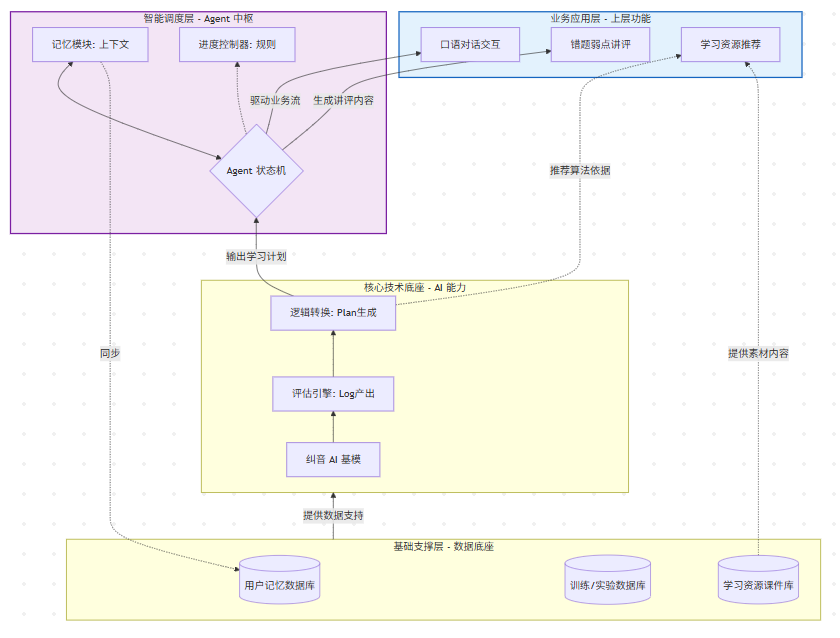
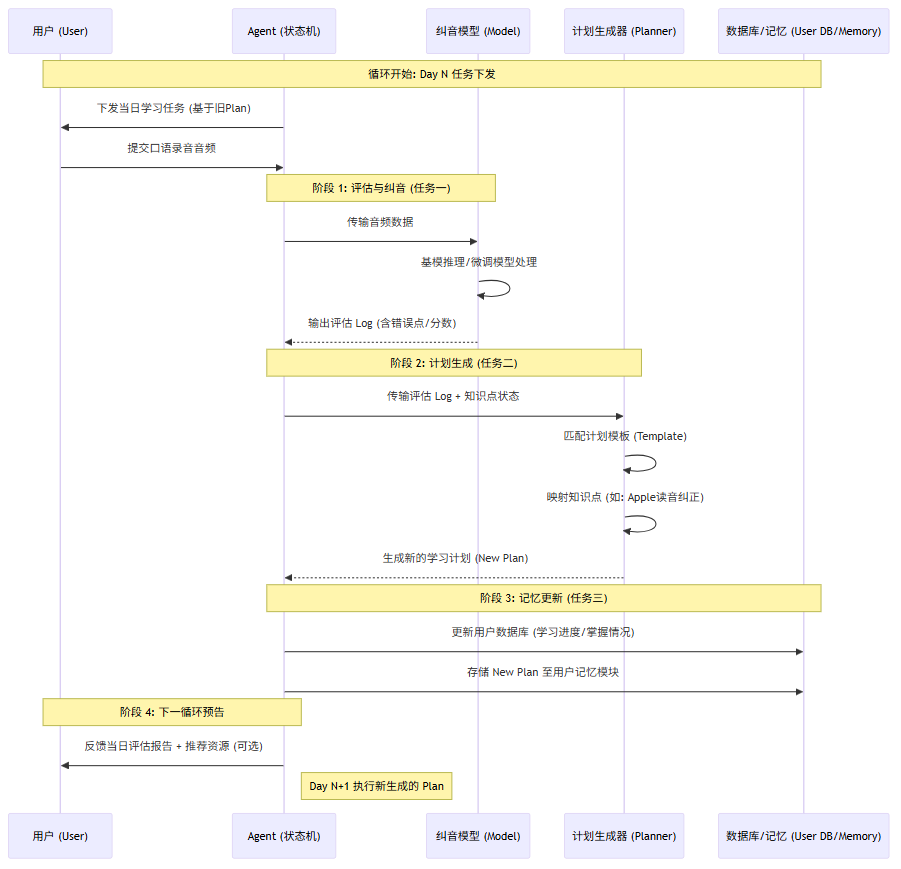

# Voice Correction System

Phoneme-level English pronunciation assessment and correction system for children learning English. Combines a fine-tuned WavLM speech model with GPT-4o to provide intelligent, personalized pronunciation feedback.

## System Architecture

```
┌─────────────────────────────────────────────────────────────────┐
│                    pronunciation_agent.py                        │
│                      (Agent Orchestration)                       │
│                                                                  │
│  Input: audio.mp3 + "Hello, Peter." + user_id                   │
│       │                                                          │
│       ▼                                                          │
│  ┌──────────┐    ┌──────────────┐    ┌───────────────┐          │
│  │ Step 1   │    │   Step 2     │    │   Step 3      │          │
│  │ WavLM    │───→│ User Memory  │───→│  GPT-4o       │          │
│  │ Assess   │    │ Load History │    │  Feedback +    │          │
│  │ Phonemes │    │              │    │  Learning Plan │          │
│  └──────────┘    └──────────────┘    └───────────────┘          │
│       │                                      │                   │
│       ▼                                      ▼                   │
│  pipeline_v2.py                    OpenAI API (gpt-4o)          │
│  (WavLM fine-tuned)               Chinese feedback + plan        │
│       │                                      │                   │
│       ▼                                      ▼                   │
│  ┌──────────┐                      ┌───────────────┐            │
│  │ Step 5   │                      │   Step 4      │            │
│  │ Return   │◀─────────────────────│ Update Memory │            │
│  └──────────┘                      └───────────────┘            │
└─────────────────────────────────────────────────────────────────┘
```





---

## Layer 1: Pronunciation Assessment Model (pipeline_v2.py)

The core engine that converts audio + reference text into phoneme-level assessment results.

### Processing Pipeline

```
"Hello, Peter."  ──→  G2P (g2p_en)  ──→  /hh ah l ow p iy t er/
                                                    │
audio.mp3  ──→  wav2vec2-xlsr-53 (CTC, frozen)      │
                    │                                │
                    ▼                                ▼
              Frame-level phoneme          Expected phoneme sequence
              probabilities                (ARPAbet → IPA mapping)
              (T frames × 392 IPA)
                    │                                │
                    └────────── Viterbi Alignment ───┘
                                    │
                                    ▼
                    Per-phoneme audio frame segments
                    /hh/ → frames 0-15, /ah/ → frames 16-30, ...
                                    │
                    ┌───────────────┼───────────────┐
                    ▼               ▼               ▼
              WavLM-Large      GOP Score        Frame count
              (fine-tuned)     log P(target)    n_frames
              1024-dim         - log P(best
              hidden states     other)
                    │               │               │
                    ▼               ▼               ▼
              ┌─────────────────────────────────────┐
              │  Concat: hidden(1024) + phone_emb(32)│
              │          + GOP(1) + n_frames(1)      │
              │                = 1058-dim             │
              └─────────────────┬───────────────────┘
                                │
                                ▼
                    MLP (1058 → 512 → 512 → 256)
                    BatchNorm + GELU + Dropout
                                │
                    ┌───────────┴───────────┐
                    ▼                       ▼
              score_head               pherr_head
              (256 → 64 → 1)          (256 → 64 → 1)
                    │                       │
                    ▼                       ▼
              Phoneme score 0-100    Error probability 0-1
              (regression)           (classification, sigmoid)
```

### Models Used

| Model | Role | Status |
|-------|------|--------|
| `wav2vec2-xlsr-53-espeak-cv-ft` | 392 IPA phoneme CTC model. Provides frame-level phoneme probabilities for Viterbi alignment and GOP computation | Frozen |
| `WavLM-Large` (microsoft/wavlm-large) | Speech feature extraction backbone, outputs 1024-dim hidden states | **Fine-tuned (top 6 layers)** |
| MLP scoring head | Predicts phoneme scores and error probabilities from concatenated features | Fully trained |

### Viterbi Forced Alignment

Aligns expected phoneme sequence to audio frames using dynamic programming on CTC emissions:

```
Input:  CTC emissions (T frames × 392 phonemes) + expected sequence [hh, ah, l, ow]
                ↓
Expand: [blank, hh, blank, ah, blank, l, blank, ow, blank]
                ↓
DP:     dp[t][s] = best path probability at frame t, state s
        Transitions: stay / advance 1 / skip blank advance 2
                ↓
Trace:  Backtrack to get per-frame phoneme assignments
                ↓
Output: /hh/ → frames[0..15], /ah/ → frames[16..30], ...
```

### GOP (Goodness of Pronunciation)

For each aligned phoneme segment:

```
GOP = mean(log P(target | frame)) - mean(max log P(other | frame))

GOP > 0  →  Model confirms this is the expected phoneme (correct)
GOP < 0  →  Model thinks another phoneme fits better (likely error)
```

GOP is used as one of the input features to the MLP, but the final error decision is made by the learned pherr_head (not a simple GOP threshold).

---

## Layer 2: User Memory (UserMemory)

JSON-file based persistent storage that tracks each user's learning progress across sessions.

```
user_memory/
└── student_001.json
    {
      "user_id": "student_001",
      "sessions": [                        // Session history
        {
          "timestamp": "2026-03-19T...",
          "text": "Hello, Lingling.",
          "overall_score": 80.1,
          "error_phonemes": [
            {"phone": "ah", "word": "Lingling", "score": 60.5},
            {"phone": "ng", "word": "Lingling", "score": 32.3}
          ]
        }
      ],
      "weak_phonemes": {                   // Cumulative per-phoneme stats
        "ah": {"count": 5, "errors": 3, "total_score": 320},
        "ng": {"count": 3, "errors": 2, "total_score": 150}
      },
      "overall_stats": {                   // Aggregate statistics
        "total_sessions": 10,
        "total_phonemes": 120,
        "total_errors": 15,
        "avg_score": 78.5
      },
      "current_plan": {                    // Active learning plan
        "focus_phonemes": ["ah", "ng"],
        "practice_words": ["sing", "long", "song"]
      }
    }
```

**Purpose:**
- Provides LLM with user history for **personalized** feedback
- Tracks improvement across sessions (e.g., "/ng/ error rate dropped from 50% to 30%")
- Persists learning plans for continuity between sessions

---

## Layer 3: LLM Agent (GPT-4o)

The agent calls GPT-4o twice per session:

### Call 1: Generate Feedback

```
System: You are an English pronunciation coach for Chinese children...

User:
  Evaluation: "Hello, Lingling." score=80.1
  Errors: /ah/ (score=60.5), /ng/ (score=32.3)
  User history: 3 sessions, weak phonemes: /ah/ (50% error), /ng/ (67% error)

  Please provide: 1. Feedback  2. Learning plan  3. Encouragement

GPT-4o → "你的Hello发得很好！Lingling里的/ah/需要张大嘴巴..."
```

### Call 2: Generate Structured Plan

```
User: Based on feedback, generate JSON learning plan

GPT-4o → {
  "focus_phonemes": ["ah", "ng"],
  "practice_words": ["sing", "long", "song"],
  "tips": ["张大嘴巴练习/ah/...", "舌头抵上牙龈练习/ng/..."]
}
```

---

## Layer 4: External Interfaces

### 1. Python API (for OpenClaw skill integration)

```python
from pronunciation_agent import PronunciationAgent

agent = PronunciationAgent()
result = agent.run(audio="audio.mp3", text="Hello, Peter.", user_id="student_001")

# result:
# {
#   "evaluation": { ... },          # Phoneme-level assessment
#   "feedback": "你的发音很好...",    # LLM-generated Chinese feedback
#   "plan": {                        # Structured learning plan
#     "focus_phonemes": ["ah", "ng"],
#     "practice_words": ["sing", "long"],
#     "tips": ["张大嘴巴练习/ah/..."]
#   },
#   "user_stats": { ... },           # Updated user statistics
#   "weak_phonemes": [ ... ]         # Historical weak phonemes
# }
```

### 2. CLI

```bash
# With agent (assessment + LLM feedback + memory)
python pronunciation_agent.py --audio audio.mp3 --text "Hello, Peter." --user student_001

# Assessment only (no LLM, no memory)
python pipeline_v2.py --audio audio.mp3 --text "Hello, Peter."
```

### 3. FastAPI REST API

```bash
# Start server
pip install fastapi uvicorn python-multipart
python pronunciation_agent.py --serve --port 8000

# Endpoints:
# POST /assess     (audio file + text + user_id) → full assessment + feedback
# GET  /user/{id}  → user learning history and stats
# GET  /health     → health check
```

### 4. Assessment-only API (pipeline_v2.py)

```python
from pipeline_v2 import PronunciationAssessorV2

# Auto-download model from HuggingFace
assessor = PronunciationAssessorV2.from_pretrained()
result = assessor.assess("audio.mp3", "Hello, Peter.")
```

---

## Setup

```bash
# Python 3.10+
pip install torch torchaudio transformers g2p-en huggingface_hub openpyxl openai

# ffmpeg for MP3 decoding
conda install -c conda-forge ffmpeg
# or: apt install ffmpeg

# Set OpenAI API key (for agent mode)
export OPENAI_API_KEY="your-key-here"
```

### Download Model

The WavLM checkpoint (~1.2GB) downloads automatically on first use. Manual download:

```bash
huggingface-cli download Jianshu001/wavlm-phoneme-scorer wavlm_finetuned.pt --local-dir .
```

---

## Training

### Data

| Dataset | Samples | Phonemes | Source |
|---------|---------|----------|--------|
| eval_log.xlsx | 1,000 sentences | 12,438 | Children's English reading |
| word_eval_log.xlsx | 10,601 words | 41,488 | Children's English words |
| **Total** | **11,601** | **53,926** | Professional annotation (pherr + score) |

### Training Configuration

```
Backbone: WavLM-Large (316M params)
  - Freeze bottom 18 layers, fine-tune top 6 layers (76.6M trainable)
  - Learning rate: 1e-5

MLP Head: 1058 → 512 → 512 → 256 → (score, pherr)
  - Learning rate: 5e-4

Optimizer: AdamW, weight_decay=1e-3
Scheduler: CosineAnnealing
Gradient accumulation: 4 steps, gradient clipping: max_norm=1.0
Early stopping: patience=8, stopped at epoch 24

Loss: MSE/100 (score) + BCE with pos_weight=5.2 (pherr)
      pos_weight compensates for class imbalance (only 16% errors)

Train/Val/Test split: 40K / 5K / 8K phonemes (split by audio file)
```

### Performance Comparison

| Method | Data | AUC | F1 | Precision | Recall | Pearson | MAE |
|--------|------|-----|-----|-----------|--------|---------|-----|
| GOP threshold (v1.0) | 1K | 0.738 | 0.476 | 0.379 | 0.638 | 0.372 | 27.44 |
| E2E MLP frozen backbone (v2) | 1K | 0.814 | 0.565 | 0.500 | 0.650 | 0.528 | 22.57 |
| Phoneme comparison | 1K | 0.691 | 0.492 | 0.379 | 0.703 | N/A | N/A |
| wav2vec2-large fine-tune | 11K | 0.844 | 0.548 | 0.527 | 0.571 | 0.574 | 17.72 |
| **WavLM-Large fine-tune** | **11K** | **0.870** | **0.595** | **0.592** | **0.598** | **0.645** | **16.47** |

### Approaches Explored

**1. GOP Threshold (v1.0)** — Compute `log P(target) - log P(best_other)` per phoneme, threshold at -2.5. Simple, no training needed, but limited by single threshold for all phonemes.

**2. E2E MLP with Frozen Backbone** — Extract wav2vec2 hidden states (frozen), train MLP head on 1K samples. Better than GOP but limited by small data and frozen features.

**3. Phoneme Comparison** — Recognize what was actually said (top CTC prediction per segment), compare against expected phonemes. High recall (0.81) but low precision (0.34) because the CTC model frequently misrecognizes children's speech.

**4. Backbone Fine-tuning (wav2vec2 vs WavLM)** — Unfreeze top layers, train end-to-end on 11K samples. WavLM's denoising pre-training makes it more robust for non-standard (children's) speech.

---

## Project Structure

```
Voice-correction/
├── pronunciation_agent.py   # Agent: assessment + LLM feedback + user memory
├── pipeline_v2.py           # Core model: WavLM fine-tuned assessment (v2.0)
├── pipeline.py              # Baseline: GOP threshold assessment (v1.0)
├── finetune_wavlm.py        # Training script: WavLM backbone fine-tuning
├── finetune_backbone.py     # Training script: wav2vec2 backbone fine-tuning
├── phoneme_compare.py       # Experiment: phoneme comparison approach
├── e2e_v2_train.py          # Training script: E2E MLP with frozen backbone
├── e2e_phoneme_scorer.py    # Training script: E2E MLP v1
├── wavlm_finetuned.pt       # Model checkpoint (auto-downloaded from HF)
├── eval_log.xlsx            # Ground truth: 1000 sentences
├── word_eval_log.xlsx       # Ground truth: 10601 words
├── audio_files/             # Sentence recordings (1000 MP3)
├── words_audio_files/       # Word recordings (10655 MP3)
├── figures/                 # Architecture diagrams
├── user_memory/             # User progress data (gitignored)
└── README.md
```

## Model on HuggingFace

[Jianshu001/wavlm-phoneme-scorer](https://huggingface.co/Jianshu001/wavlm-phoneme-scorer)

## Known Limitations

- G2P-generated phoneme sequences may not perfectly match ground truth sequences
- Does not handle numbers ("8 o'clock") or non-English names well
- v2.0 requires GPU (~22GB VRAM) for inference; v1.0 can run on CPU
- LLM feedback quality depends on the GPT-4o model and prompt engineering
